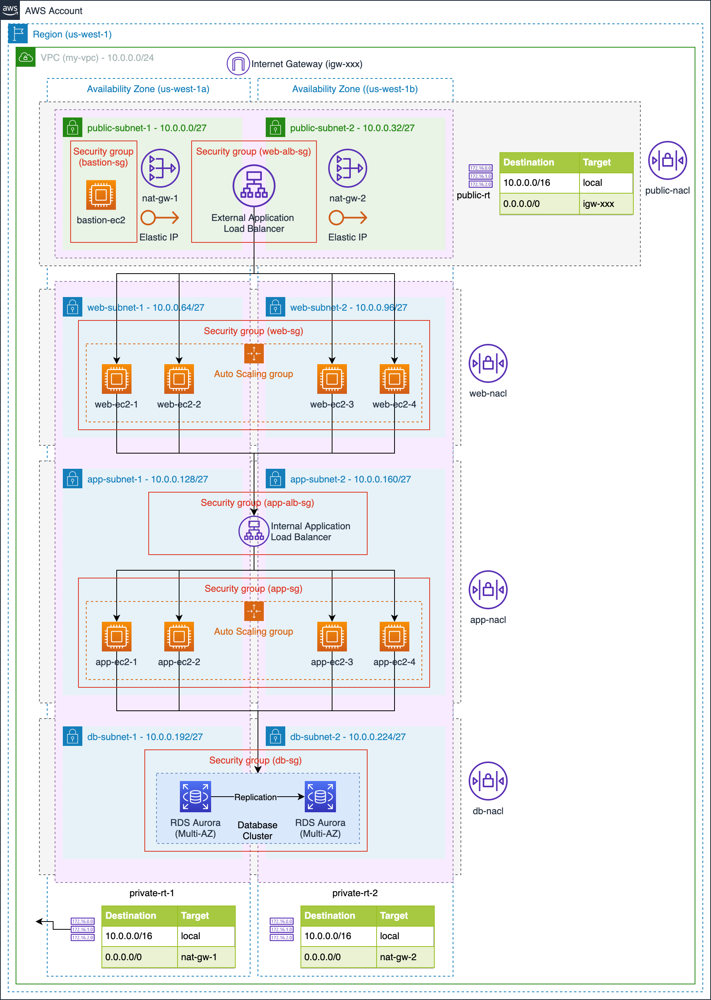
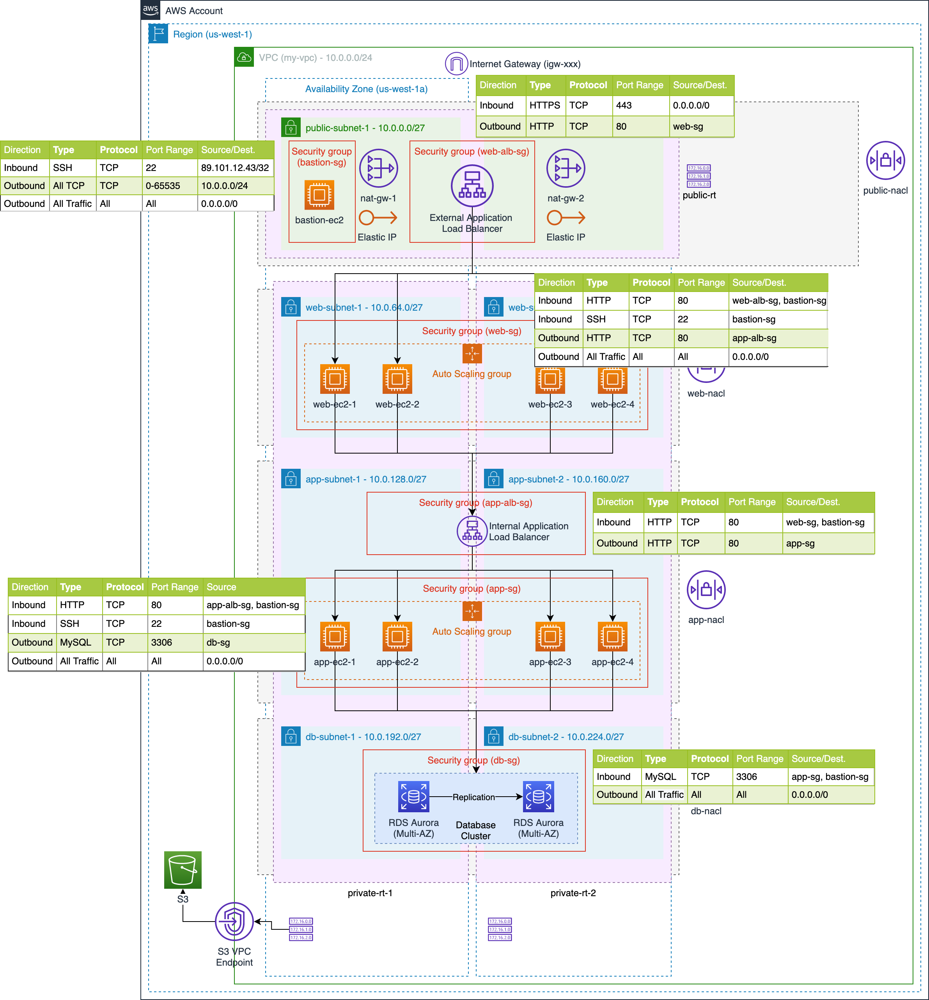
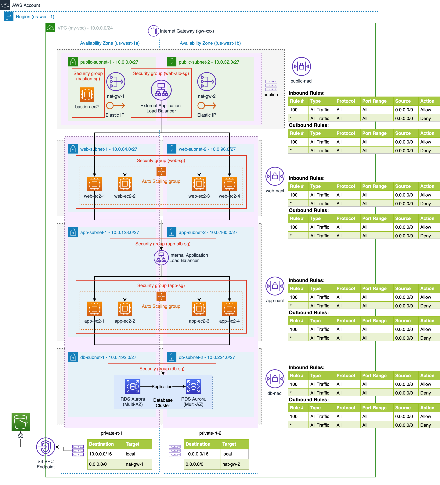

# How to design "AWS VPC" for your application? 

### Watch YouTube Video:

### VPC Architecture of 3-Tier Application

### 3-Tier Application Security Group Configurations

### 3-Tier Application NACL Configurations

